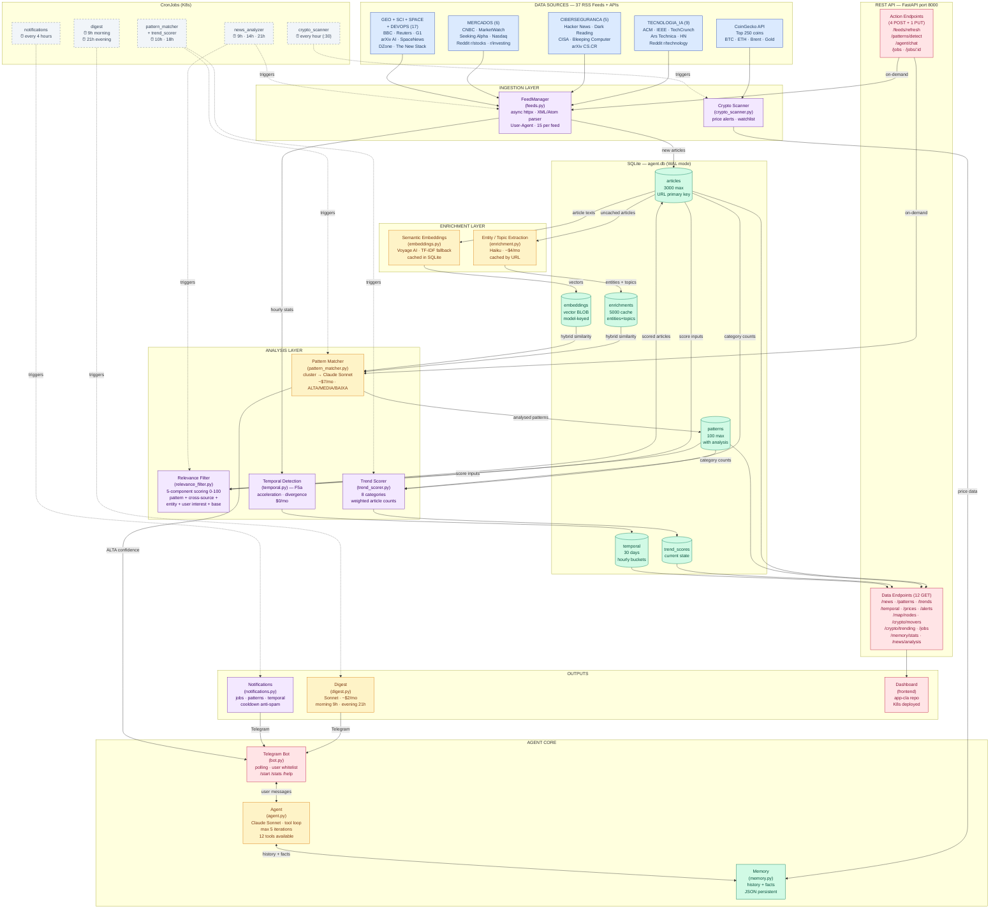
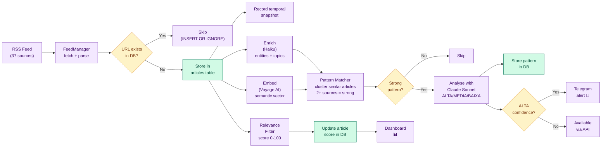

# Personal Intelligence Agent — Architecture

## System Overview



## Data Flow — Article Lifecycle



## Cost Summary

```
┌──────────────────────────────────────────────────┐
│          Monthly Cost Breakdown (~$15)            │
├──────────────────────┬──────────┬────────────────┤
│ Component            │ Model    │ Cost/month     │
├──────────────────────┼──────────┼────────────────┤
│ Pattern Matcher      │ Sonnet   │ ~$7.20         │
│ Enrichment           │ Haiku    │ ~$3.60         │
│ Digest (2x/day)      │ Sonnet   │ ~$2.00         │
│ News Analyzer alerts │ Sonnet   │ ~$1.50         │
│ Crypto alerts        │ Sonnet   │ ~$0.70         │
├──────────────────────┼──────────┼────────────────┤
│ Temporal (F5a)       │ Python   │ $0.00          │
│ Trend Scorer         │ Python   │ $0.00          │
│ Relevance Filter     │ Python   │ $0.00          │
│ Voyage AI embeddings │ API      │ $0.00 (free)   │
├──────────────────────┼──────────┼────────────────┤
│ TOTAL                │          │ ~$15/month     │
└──────────────────────┴──────────┴────────────────┘
```

## Infrastructure

```
┌─ Kubernetes Cluster ─────────────────────────────┐
│                                                   │
│  ┌─ Namespace: personal-agent ─────────────────┐ │
│  │                                              │ │
│  │  Deployment: personal-agent (1 replica)      │ │
│  │  ├── Container: agent                        │ │
│  │  │   ├── Image: app-cla-agent:sha-xxxxx      │ │
│  │  │   ├── CMD: python bot.py                  │ │
│  │  │   ├── Port: 8000 (FastAPI)                │ │
│  │  │   ├── CPU: 100m-500m                      │ │
│  │  │   └── RAM: 128Mi-512Mi                    │ │
│  │  └── Volume: agent-data (PVC)                │ │
│  │      └── /data/agent.db (SQLite + WAL)       │ │
│  │                                              │ │
│  │  Service: agent-api (ClusterIP:8000)         │ │
│  │                                              │ │
│  │  CronJobs: 5 scheduled tasks                 │ │
│  │  ├── news_analyzer   (9h, 14h, 21h)         │ │
│  │  ├── crypto_scanner  (every hour)            │ │
│  │  ├── pattern_matcher (10h, 18h)              │ │
│  │  ├── digest          (9h, 21h)               │ │
│  │  └── notifications   (every 4h)              │ │
│  │                                              │ │
│  │  Secrets: agent-secrets (SOPS + age)         │ │
│  │  ├── ANTHROPIC_API_KEY                       │ │
│  │  ├── TELEGRAM_BOT_TOKEN                      │ │
│  │  ├── TELEGRAM_ALLOWED_USER_ID                │ │
│  │  └── VOYAGE_API_KEY (optional)               │ │
│  └──────────────────────────────────────────────┘ │
│                                                   │
│  ┌─ Namespace: personal-agent (frontend) ───────┐ │
│  │  Deployment: backend (Go API proxy)          │ │
│  │  Deployment: frontend (React dashboard)      │ │
│  │  Ingress: dashboard.local                    │ │
│  └──────────────────────────────────────────────┘ │
│                                                   │
│  ArgoCD: auto-sync from github.com/josecarlosjr  │
│  ├── app-cla (K8s manifests + KSOPS)             │
│  └── app-cla-image (Docker image source)         │
└───────────────────────────────────────────────────┘
```
