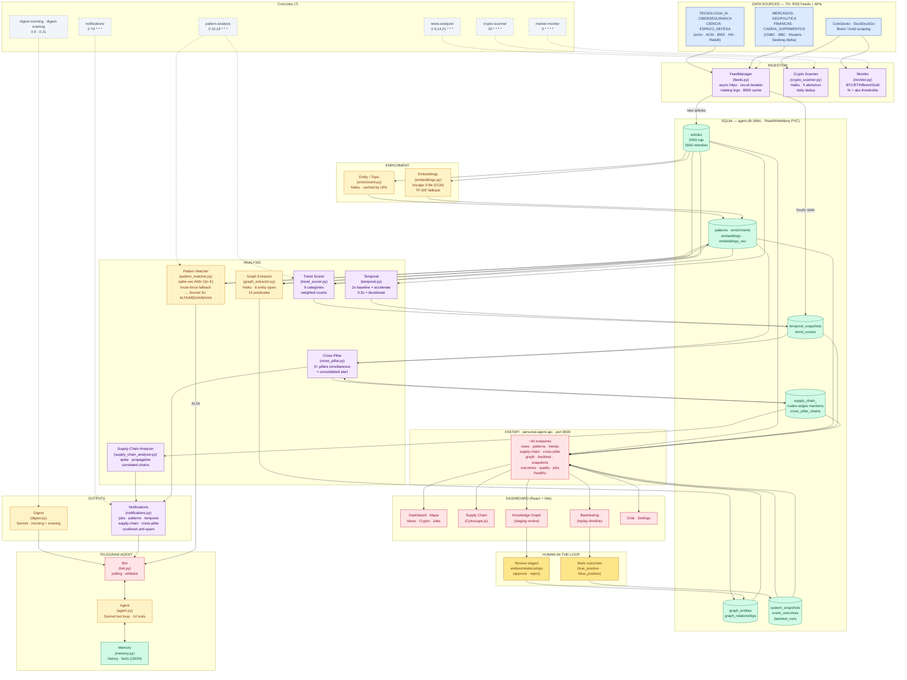
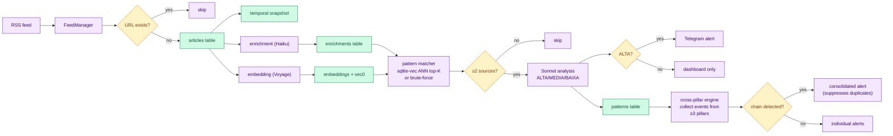
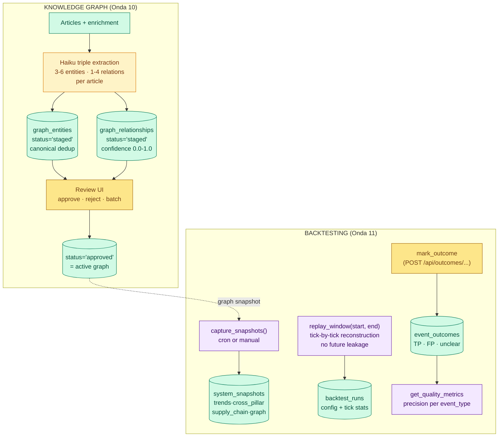

# Personal Intelligence Agent — Architecture

## Overview

The Personal Intelligence Agent (PIA) is a single-user system that ingests
~70 RSS feeds across 11 categories plus market and crypto APIs, applies a
mix of LLM analysis and rule-based scoring to surface signal, and exposes
the results through three outputs: a Telegram bot, a React dashboard and a
backtest/quality-metrics page.

The pipeline is built in iterative waves ("Ondas"):

| Wave | Capability | Status |
|------|------------|--------|
| 1–3  | RSS ingestion · pattern matching · digest | shipped |
| 4    | Static supply-chain knowledge graph | shipped |
| 5a   | Temporal acceleration / divergence detection | shipped |
| 6    | Supply-chain anomaly detection (spike, propagation, correlated chains) | shipped |
| 7    | Supply-chain visualisation page (Cytoscape.js) | shipped |
| 8    | sqlite-vec ANN clustering + embedding versioning | shipped |
| 9    | Cross-pillar correlation engine (4 pillars · alert consolidation) | shipped |
| 10   | Dynamic Knowledge Graph with human review (staged → approved) | shipped |
| 11   | Backtesting · system snapshots · outcome labelling · quality metrics | shipped |

## System Overview


```mermaid
flowchart TB
    classDef source fill:#dbeafe,stroke:#1e40af,color:#1e3a5f
    classDef process fill:#f3e8ff,stroke:#6b21a8,color:#3b0764
    classDef llm fill:#fef3c7,stroke:#d97706,color:#78350f
    classDef store fill:#d1fae5,stroke:#047857,color:#064e3b
    classDef output fill:#ffe4e6,stroke:#be123c,color:#881337
    classDef cron fill:#f1f5f9,stroke:#64748b,color:#334155,stroke-dasharray: 5 5
    classDef human fill:#fde68a,stroke:#a16207,color:#713f12

    subgraph SOURCES["DATA SOURCES — 70+ RSS Feeds + APIs"]
        direction LR
        S_TECH["TECNOLOGIA_IA · CIBERSEGURANCA<br/>CIENCIA · ESPACO_DEFESA<br/>(arXiv · ACM · IEEE · HN · Reddit)"]:::source
        S_MKT["MERCADOS · GEOPOLITICA<br/>FINANCAS · CADEIA_SUPRIMENTOS<br/>(CNBC · BBC · Reuters · Seeking Alpha)"]:::source
        S_API["CoinGecko · DuckDuckGo<br/>Brent / Gold scraping"]:::source
    end

    subgraph INGESTION["INGESTION"]
        FM["FeedManager<br/>(feeds.py)<br/>async httpx · circuit breaker<br/>rotating logs · 8000 cache"]:::process
        CS["Crypto Scanner<br/>(crypto_scanner.py)<br/>Haiku · 5 alerts/run<br/>daily dedup"]:::process
        MON["Monitor<br/>(monitor.py)<br/>BTC/ETH/Brent/Gold<br/>% + abs thresholds"]:::process
    end

    subgraph ENRICHMENT["ENRICHMENT"]
        ENR["Entity / Topic<br/>(enrichment.py)<br/>Haiku · cached by URL"]:::llm
        EMB["Embeddings<br/>(embeddings.py)<br/>Voyage 3-lite (512d)<br/>TF-IDF fallback"]:::llm
    end

    subgraph ANALYSIS["ANALYSIS"]
        direction LR
        PM["Pattern Matcher<br/>(pattern_matcher.py)<br/>sqlite-vec ANN O(n·K)<br/>brute-force fallback<br/>→ Sonnet for ALTA/MEDIA/BAIXA"]:::llm
        TS["Trend Scorer<br/>(trend_scorer.py)<br/>9 categories<br/>weighted counts"]:::process
        TMP["Temporal<br/>(temporal.py)<br/>2x baseline = accelerate<br/>0.3x = decelerate"]:::process
        SCA["Supply-Chain Analyzer<br/>(supply_chain_analyzer.py)<br/>spike · propagation<br/>correlated chains"]:::process
        XPL["Cross-Pillar<br/>(cross_pillar.py)<br/>3+ pillars simultaneous<br/>= consolidated alert"]:::process
        GEX["Graph Extractor<br/>(graph_extractor.py)<br/>Haiku · 8 entity types<br/>14 predicates"]:::llm
    end

    subgraph DB["SQLite — agent.db (WAL · ReadWriteMany PVC)"]
        direction LR
        DB1[("articles<br/>2000 cap<br/>365d retention")]:::store
        DB2[("patterns · enrichments<br/>embeddings · embeddings_vec")]:::store
        DB3[("temporal_snapshots<br/>trend_scores")]:::store
        DB4[("supply_chain_<br/>nodes·edges·mentions<br/>cross_pillar_chains")]:::store
        DB5[("graph_entities<br/>graph_relationships")]:::store
        DB6[("system_snapshots<br/>event_outcomes<br/>backtest_runs")]:::store
    end

    subgraph AGENT["TELEGRAM AGENT"]
        BOT["Bot<br/>(bot.py)<br/>polling · whitelist"]:::output
        AG["Agent<br/>(agent.py)<br/>Sonnet tool loop · 14 tools"]:::llm
        MEM["Memory<br/>(memory.py)<br/>history · facts (JSON)"]:::store
    end

    subgraph API["FASTAPI · personal-agent-api · port 8000"]
        direction LR
        APIR["~40 endpoints<br/>news · patterns · trends<br/>supply-chain · cross-pillar<br/>graph · backtest · snapshots<br/>outcomes · quality · jobs<br/>/healthz"]:::output
    end

    subgraph FRONTEND["DASHBOARD (React + Vite)"]
        direction LR
        UI1["Dashboard · Mapa<br/>News · Crypto · Jobs"]:::output
        UI2["Supply Chain<br/>(Cytoscape.js)"]:::output
        UI3["Knowledge Graph<br/>(staging review)"]:::output
        UI4["Backtesting<br/>(replay timeline)"]:::output
        UI5["Chat · Settings"]:::output
    end

    subgraph OUT["OUTPUTS"]
        DG["Digest<br/>(digest.py)<br/>Sonnet · morning + evening"]:::llm
        NF["Notifications<br/>(notifications.py)<br/>jobs · patterns · temporal<br/>supply-chain · cross-pillar<br/>cooldown anti-spam"]:::process
    end

    subgraph CRONS["CronJobs (7)"]
        direction TB
        C1["market-monitor<br/>0 * * * *"]:::cron
        C2["crypto-scanner<br/>30 * * * *"]:::cron
        C3["news-analyzer<br/>0 9,14,21 * * *"]:::cron
        C4["pattern-analysis<br/>0 10,18 * * *"]:::cron
        C5["digest-morning · digest-evening<br/>0 9 · 0 21"]:::cron
        C6["notifications<br/>0 */4 * * *"]:::cron
    end

    subgraph HUMAN["HUMAN-IN-THE-LOOP"]
        REV["Review staged<br/>entities/relationships<br/>(approve · reject)"]:::human
        OUT_LBL["Mark outcomes<br/>(true_positive · false_positive)"]:::human
    end

    %% Data flow
    S_TECH & S_MKT --> FM
    S_API --> CS & MON

    FM -->|new articles| DB1
    FM -->|hourly stats| DB3
    DB1 --> ENR & EMB
    ENR & EMB --> DB2
    DB2 --> PM
    PM --> DB2
    DB1 & DB2 --> TS --> DB3
    DB1 --> TMP --> DB3
    DB4 --> SCA
    DB2 & DB4 & DB3 --> XPL --> DB4
    DB1 & DB2 --> GEX --> DB5

    %% Crons
    C1 -.-> MON
    C2 -.-> CS
    C3 -.-> FM
    C4 -.-> PM
    C4 -.-> TS
    C5 -.-> DG
    C6 -.-> NF

    %% Outputs
    DB1 & DB2 & DB3 & DB4 & DB5 & DB6 --> APIR
    APIR --> UI1 & UI2 & UI3 & UI4 & UI5

    BOT <--> AG
    AG <--> MEM
    DG --> BOT
    NF --> BOT
    PM -->|ALTA| BOT
    SCA --> NF
    XPL --> NF

    %% Human
    UI3 --> REV --> DB5
    UI4 --> OUT_LBL --> DB6
    DB6 --> APIR
```

## Article Lifecycle


```mermaid
flowchart LR
    classDef step fill:#f3e8ff,stroke:#6b21a8,color:#3b0764
    classDef decision fill:#fef3c7,stroke:#d97706,color:#78350f
    classDef store fill:#d1fae5,stroke:#047857,color:#064e3b

    A["RSS feed"]:::step --> B["FeedManager"]:::step --> C{"URL exists?"}:::decision
    C -->|yes| D["skip"]:::step
    C -->|no| E["articles table"]:::store
    E --> F["temporal snapshot"]:::store
    E --> G["enrichment (Haiku)"]:::step --> G2["enrichments table"]:::store
    E --> H["embedding (Voyage)"]:::step --> H2["embeddings + vec0"]:::store
    G2 & H2 --> I["pattern matcher<br/>sqlite-vec ANN top-K<br/>or brute-force"]:::step
    I --> J{"≥2 sources?"}:::decision
    J -->|no| K["skip"]:::step
    J -->|yes| L["Sonnet analysis<br/>ALTA/MEDIA/BAIXA"]:::step
    L --> M["patterns table"]:::store
    L --> N{"ALTA?"}:::decision
    N -->|yes| O["Telegram alert"]:::step
    N -->|no| P["dashboard only"]:::step
    M --> Q["cross-pillar engine<br/>collect events from<br/>≥3 pillars"]:::step
    Q --> R{"chain detected?"}:::decision
    R -->|yes| S["consolidated alert<br/>(suppresses duplicates)"]:::step
    R -->|no| T["individual alerts"]:::step
```

## Knowledge Graph + Backtesting


```mermaid
flowchart TB
    classDef llm fill:#fef3c7,stroke:#d97706,color:#78350f
    classDef store fill:#d1fae5,stroke:#047857,color:#064e3b
    classDef human fill:#fde68a,stroke:#a16207,color:#713f12
    classDef process fill:#f3e8ff,stroke:#6b21a8,color:#3b0764

    %% Knowledge Graph
    subgraph KG["KNOWLEDGE GRAPH (Onda 10)"]
        K1["Articles + enrichment"]:::store
        K2["Haiku triple extraction<br/>3-6 entities · 1-4 relations<br/>per article"]:::llm
        K3[("graph_entities<br/>status='staged'<br/>canonical dedup")]:::store
        K4[("graph_relationships<br/>status='staged'<br/>confidence 0.0-1.0")]:::store
        K5["Review UI<br/>approve · reject · batch"]:::human
        K6[("status='approved'<br/>= active graph")]:::store
        K1 --> K2 --> K3 & K4 --> K5 --> K6
    end

    %% Backtesting
    subgraph BT["BACKTESTING (Onda 11)"]
        B1["capture_snapshots()<br/>cron or manual"]:::process
        B2[("system_snapshots<br/>trends·cross_pillar<br/>supply_chain·graph")]:::store
        B3["replay_window(start, end)<br/>tick-by-tick reconstruction<br/>no future leakage"]:::process
        B4[("backtest_runs<br/>config + tick stats")]:::store
        B5["mark_outcome<br/>(POST /api/outcomes/...)"]:::human
        B6[("event_outcomes<br/>TP · FP · unclear")]:::store
        B7["get_quality_metrics<br/>precision per event_type"]:::process
        B1 --> B2
        B3 --> B4
        B5 --> B6 --> B7
        K6 -.->|graph snapshot| B1
    end
```

## Database Schema

| Table | Purpose | Key columns | Retention |
|-------|---------|-------------|-----------|
| `articles` | RSS articles + relevance score | url (PK), category, fetched_at, relevance_score | 365d (configurable) |
| `patterns` | Detected cross-source patterns | id, articles_json, confidence (ALTA/MEDIA/BAIXA) | 100 most recent |
| `enrichments` | Haiku entity/topic extractions | url (PK), entities_json, topics_json | 12000 most recent |
| `embeddings` | Voyage AI vectors | url (PK), vector BLOB, embedding_version | 25000 most recent |
| `embeddings_vec` | sqlite-vec virtual table mirror | url (PK), embedding (vec0) | synced with `embeddings` |
| `trend_scores` | Latest category scores + connections | key, data_json | current state only |
| `temporal_snapshots` | Hourly article counts per category | category, bucket | 30d |
| `supply_chain_nodes` | 24 mineral/component/product nodes | id, name, type | static seed |
| `supply_chain_edges` | 36 dependency edges | src, dst, relation | static seed |
| `supply_chain_mentions` | Article-level mentions | node_id, article_url, sentiment | 30d |
| `cross_pillar_chains` | Detected ≥3-pillar simultaneous events | id, members_hash, pillars_json | 60d |
| `graph_entities` | Knowledge graph entities | canonical (UNIQUE), status, mention_count | indefinite |
| `graph_relationships` | Knowledge graph triples | subject_id, predicate, object_id, confidence | indefinite |
| `system_snapshots` | State-over-time captures | snapshot_type, captured_at, data_json | 365d |
| `event_outcomes` | User TP/FP labels | event_type + event_id (UNIQUE), outcome | indefinite |
| `backtest_runs` | Replay results | window, config_json, result_json | indefinite |

Schema bootstrap is self-healing: `_db()` runs `_migrate_embeddings_schema`
*before* `executescript(_SCHEMA)` (so CREATE INDEX statements never hit a
stale column), and `_ensure_late_added_tables` re-applies the schema if any
of the tables introduced by Onda 10/11 are missing.

## API Endpoints (FastAPI · port 8000)

```
LIVENESS
  GET  /healthz                               · DB-free, used by k8s probes

INGESTION + DETECTION (4 POST)
  POST /api/feeds/refresh                     · pull all feeds + score
  POST /api/patterns/detect                   · cluster + Sonnet analysis
  POST /api/agent/chat                        · Telegram-style chat
  POST /api/supply-chain/extract              · scan article mentions

DATA / READ (~20 GET)
  GET  /api/news[?category=]                  · scored articles
  GET  /api/news/analysis                     · last analysis run
  GET  /api/patterns[?confidence=][&category=]
  GET  /api/trends                            · category scores + connections
  GET  /api/temporal                          · acceleration/divergence
  GET  /api/map/nodes                         · dashboard graph
  GET  /api/prices · /api/alerts
  GET  /api/crypto/movers · /crypto/trending
  GET  /api/jobs · /api/memory/stats
  GET  /api/supply-chain · /supply-chain/analysis
  GET  /api/supply-chain/impact/{node_id}
  GET  /api/supply-chain/mentions
  GET  /api/cross-pillar/chains · /cross-pillar/active

KNOWLEDGE GRAPH (Onda 10 · 8 endpoints)
  GET  /api/graph/stats · /graph/entities · /graph/relationships · /graph/full
  POST /api/graph/extract                     · run Haiku triple extraction
  POST /api/graph/entities/{id}/review        · approve/reject single
  POST /api/graph/relationships/{id}/review
  POST /api/graph/entities/batch-review       · {"action":"approve","ids":[...]}
  POST /api/graph/relationships/batch-review

BACKTEST + SNAPSHOTS + OUTCOMES (Onda 11 · 8 endpoints)
  POST /api/backtest/run                      · {"days_back":30,...}
  GET  /api/backtest/runs · /backtest/runs/{id}
  POST /api/snapshots/capture
  GET  /api/snapshots[?snapshot_type=]
  POST /api/outcomes/{event_type}/{event_id}  · TP/FP/unclear
  GET  /api/outcomes
  GET  /api/metrics/quality                   · precision per event type

JOBS (CRUD)
  GET/POST /api/jobs · PUT /api/jobs/{id}
```

## Cost Summary

```
┌──────────────────────────────────────────────────────────┐
│           Monthly Anthropic API Cost — ~$15              │
├──────────────────────────┬──────────┬───────────────────┤
│ Component                │ Model    │ Cost/month        │
├──────────────────────────┼──────────┼───────────────────┤
│ Pattern Matcher          │ Sonnet   │ ~$7.20            │
│ Enrichment               │ Haiku    │ ~$3.60            │
│ Digest (2x/day)          │ Sonnet   │ ~$2.00            │
│ News Analyzer            │ Sonnet   │ ~$1.50            │
│ Knowledge Graph extract  │ Haiku    │ ~$1.20            │
│ Crypto alerts            │ Haiku ⭐ │ ~$0.20            │
├──────────────────────────┼──────────┼───────────────────┤
│ Temporal · Trend · etc.  │ Python   │ $0.00             │
│ Supply-chain · Cross-p.  │ Python   │ $0.00             │
│ Backtest replay          │ Python   │ $0.00             │
│ Voyage AI embeddings     │ API      │ $0.00 (free tier) │
├──────────────────────────┼──────────┼───────────────────┤
│ TOTAL                    │          │ ~$15/month        │
└──────────────────────────┴──────────┴───────────────────┘

⭐ Crypto alerts switched from Sonnet ($0.70) to Haiku ($0.20) —
   workload (150-word structured PT-BR analysis) is Haiku's sweet spot.
```

## Infrastructure

```
┌─ Kubernetes Cluster ───────────────────────────────────────┐
│                                                             │
│  ┌─ Namespace: personal-agent ─────────────────────────────┐│
│  │                                                          ││
│  │  Deployment: personal-agent (1 replica) ── Telegram bot ││
│  │  ├── Container: agent · CMD: python bot.py              ││
│  │  ├── exec liveness/readiness probe                      ││
│  │  └── Volume: /data/agent.db (SQLite + WAL)              ││
│  │                                                          ││
│  │  Deployment: personal-agent-api (2 replicas) ── FastAPI ││
│  │  ├── Container: api · CMD: uvicorn api:app              ││
│  │  ├── Port: 8000 · readiness/liveness on /openapi.json   ││
│  │  │   (planned: switch to /healthz once new image ships) ││
│  │  └── Volume: /data/agent.db (shared via RWX PVC)        ││
│  │                                                          ││
│  │  Service: personal-agent-api (ClusterIP:8000)           ││
│  │                                                          ││
│  │  CronJobs (7):                                          ││
│  │  ├── market-monitor      (0 * * * *)                    ││
│  │  ├── crypto-scanner      (30 * * * *)                   ││
│  │  ├── news-analyzer       (0 9,14,21 * * *)              ││
│  │  ├── pattern-analysis    (0 10,18 * * *)                ││
│  │  ├── digest-morning      (0 9 * * *)                    ││
│  │  ├── digest-evening      (0 21 * * *)                   ││
│  │  └── notifications       (0 */4 * * *)                  ││
│  │                                                          ││
│  │  PVC: agent-data (5Gi · ReadWriteMany · hostPath)       ││
│  │                                                          ││
│  │  Secrets: agent-secrets (SOPS-encrypted with age)       ││
│  │  ├── ANTHROPIC_API_KEY                                  ││
│  │  ├── TELEGRAM_BOT_TOKEN                                 ││
│  │  ├── TELEGRAM_ALLOWED_USER_ID                           ││
│  │  └── VOYAGE_API_KEY (optional · TF-IDF fallback)        ││
│  └──────────────────────────────────────────────────────────┘│
│                                                             │
│  Frontend (separate deployment):                            │
│  ├── React + Vite + Cytoscape.js + Tailwind                 │
│  ├── Pages: Dashboard · Mapa · News · Crypto · Jobs ·       │
│  │          Supply Chain · Knowledge Graph · Backtesting    │
│  │          · Chat · Settings                               │
│  └── Ingress: dashboard.local                               │
│                                                             │
│  ArgoCD auto-sync from GitHub:                              │
│  ├── josecarlosjr/app-cla        (k8s manifests + KSOPS)    │
│  └── josecarlosjr/app-cla-image  (Docker build source)      │
└─────────────────────────────────────────────────────────────┘
```

### Notes on the current deployment

- The `personal-agent-api` deployment runs `replicas: 2` against a
  `ReadWriteMany` PVC. SQLite on RWX works for our read-heavy load thanks
  to WAL mode, but means schema migrations need to be idempotent and
  safe under concurrent open — see `_migrate_embeddings_schema` and
  `_ensure_late_added_tables`.
- The bot deployment image (`sha-e69ca8f`) is older than the API image
  (`sha-16e20cc`). They share the same source tree so this is only a
  GitOps-lag issue, not a contract divergence.

## Computational Techniques

The system is **LLM-centric with rule-based scaffolding**:

- **LLMs** (Sonnet for analysis/synthesis, Haiku for extraction) — no
  fine-tuning, just structured prompting with forced JSON tool use.
- **Embeddings** — Voyage 3-lite (512-dim) with TF-IDF fallback, served
  through `sqlite-vec` (vec0 virtual table) for top-K cosine search.
- **Clustering** — greedy single-pass single-linkage at thresholds
  `semantic=0.5` / `tfidf=0.3` / `semantic+entity=0.35`; minimum 2 distinct
  sources for a "strong" pattern.
- **Scoring** — hand-tuned heuristics: `relevance_filter` (5-component
  score 0–100), `trend_scorer` (weighted category counts), `temporal`
  (acceleration/divergence ratios with fixed thresholds).
- **No** ML training, no NER models, no time-series forecasting, no
  reinforcement learning. The "knowledge graph" was added in Onda 10 —
  before that, the dashboard graph was just a category-connection
  visualisation, not a true graph.
